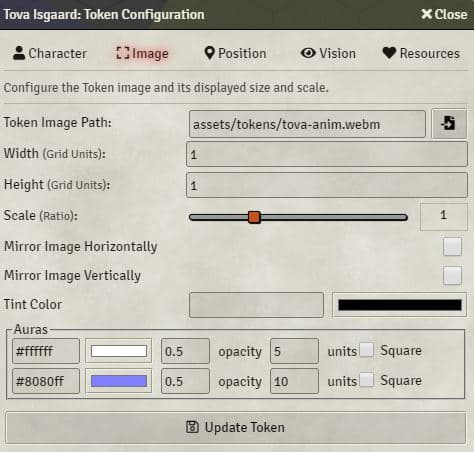
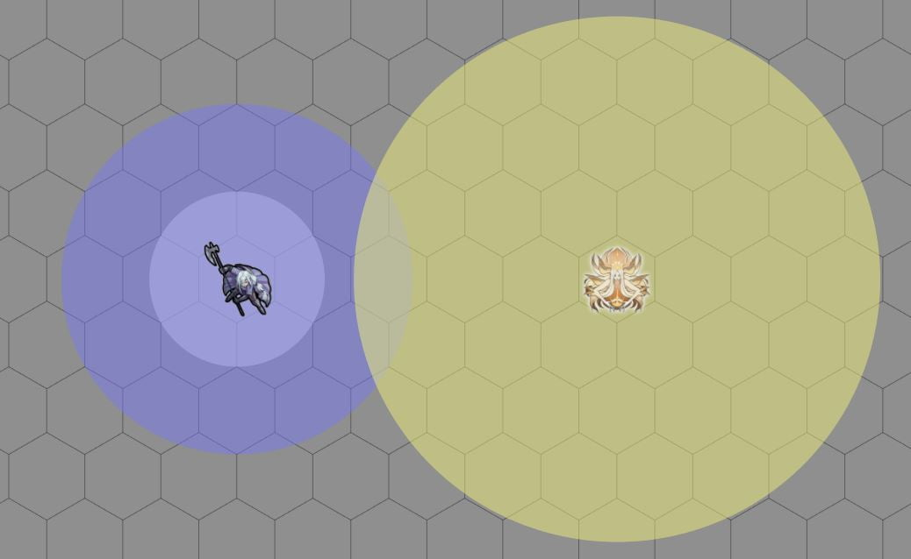

# Tokens Effects

There are more than 300 modules in foundry vtt so the scope of this module is to reduce the number of modules on your game and integrate them with each other and put together something that works.

This project is born for install on one single module the following modules for manage effects on token and avoid collisions and strange behaviours:

- [Token Auras](https://bitbucket.org/Fyorl/token-auras/src/master/) ty to [Fyorl](https://bitbucket.org/Fyorl/)
- [NoTokenAnim](https://bitbucket.org/Fyorl/notokenanim/src/master/) ty to [Fyorl](https://bitbucket.org/Fyorl/)
- [Colored Effects](https://github.com/sean8223/coloredeffects) ty to [sean8223](https://github.com/sean8223)
- [Sheet To Token](https://gitlab.com/brunhine/foundry-SheetToToken/) ty to [brunhine](https://gitlab.com/brunhine)
- [Point of Vision](https://github.com/eadorin/point-of-vision) ty to [eadorin](https://github.com/eadorin) (Still not work need more developing)

I loved each of the modules mentioned above, but sadly some seem abandoned or incompatible with any of the other 300 foundryvtt modules. I don't want to take any credit. I just took the ideas and the code of the various modules and integrated them together (in particular where it was possible with 'libwrappper'), so that they do not get any conflict and can be disabled from the module settings without having to go to 'module management'.

## Installation

It's always easiest to install modules from the in game add-on browser.

To install this module manually:
1.  Inside the Foundry "Configuration and Setup" screen, click "Add-on Modules"
2.  Click "Install Module"
3.  In the "Manifest URL" field, paste the following url:
`https://raw.githubusercontent.com/p4535992/coloredeffects/master/src/module.json`
4.  Click 'Install' and wait for installation to complete
5.  Don't forget to enable the module in game using the "Manage Module" button

### libWrapper

This module uses the [libWrapper](https://github.com/ruipin/fvtt-lib-wrapper) library for wrapping core methods. It is a hard dependency and it is recommended for the best experience and compatibility with other modules.

### Color Settings

This module uses the [color settings](https://github.com/ardittristan/VTTColorSettings) library like a dependency. It is a hard dependency and it is recommended for the best experience and compatibility with other modules.

## Settings

- coloredEffectsEnabled : 
    - overlayColor : Color for overlay icons as a hex string (rrggbb)
    - overlayAlpha : Opacity of overlay icons (0 = fully transparent, 1 = fully opaque)
    - statusBackgroundColor : Background color of status icons as a hex string (rrggbb)
    - statusBackgroundAlpha : "Opacity of status icon background (0 = fully transparent, 1 = fully opaque)
    - statusBorderColor : Color of status icon border as a hex string (rrggbb)
    - statusBorderWidth : Width in pixels of status icon border
    - statusColor : Color for status icons as a hex string (rrggbb)
    - statusAlpha : Opacity of status icons (0 = fully transparent, 1 = fully opaque)

- notokenanimEnabled : A Foundry VTT settings that provides an option to remove token movement animations.

- aurasEnabled : For configuring token auras. Auras are visual only, but should work in any system and can be used as a basis to build more advanced features on top of. The module adds configuration options for up to two auras to the token configuration dialog, and additional auras can be added programmatically, with no limit.

- sheetToTokenEnabled: Sheet To Token is a module for Foundry VTT that automatically updates an actor's Prototype Token to match its actor image when updated. Change the image of an actor, and the Prototype Token will be changed as well.

## Features


### [Colored Effect](https://github.com/sean8223/coloredeffects)

Install the module and open the Game Settings window. Click "Configure Settings" and select the "Module Settings" tab. You will see options for the various color properties for icons under the "Colored Effects" menu. Modify them as you see fit, and click "Save Changes".

An extension module for FoundryVTT that adds style settings for status and overlay icons.

For overlay icons, user-defined color and opacity settings are available. For status icons, user-defined color and opacity, as well as background color, opacity and border settings are available.

### [No animation token](https://bitbucket.org/Fyorl/notokenanim/src/master/)

A Foundry module VTT settings that provides an option to remove token movement animations.

### [Token Auras](https://bitbucket.org/Fyorl/token-auras/src/master/)

A [FoundryVTT](https://foundryvtt.com) module for configuring token auras. Auras are visual only, but should work in any system and can be used as a basis to build more advanced features on top of. The module adds configuration options for up to two auras to the token configuration dialog, and additional auras can be added programmatically, with no limit.





##### API

Aura objects have the following properties:
```js
{
    distance: number|null, // The radius (in grid units) of the aura.
    colour: string, // An HTML hexadecimal colour.
    opacity: number, // The opacity of the aura between 0 and 1.
    square: boolean, // The aura is square if true, otherwise it is circular.
    uuid: string // A unique identifier for every aura.
}
```

A new aura can be created with:
```js
Auras.newAura();
```

##### Examples

Programmatically edit the radius of an aura to be `10` grid units:
```js
token.setFlag('foundryvtt-tokeneffects', 'aura1.distance', 10);
```

The UI-configurable auras are stored in `aura1` and `aura2`, but additional auras can be added by adding to the `auras` array:
```js
const auras = duplicate(token.getFlag('foundryvtt-tokeneffects', 'auras'));
const newAura = Auras.newAura();
newAura.distance = 15;
newAura.colour = '#ff0000';
auras.push(newAura);
token.setFlag('foundryvtt-tokeneffects', 'auras', existingAuras);
```

### [Sheet To Token](https://gitlab.com/brunhine/foundry-SheetToToken/)

### [Point of Vision](https://github.com/eadorin/point-of-vision)

Point of Vision is designed to let the DM set the point of origin for LOS for tokens.


### Usage

- Right-click on a token
- Select the Token config gear
- Click on the 'Vision' tab
- Select your desired Point of Vision from the "Point of Vision" drop down menu. Positions are relative to the token

## [Changelog](./changelog.md)

## Issues

Any issues, bugs, or feature requests are always welcome to be reported directly to the [Issue Tracker](https://github.com/p4535992/coloredeffects/issues ), or using the [Bug Reporter Module](https://foundryvtt.com/packages/bug-reporter/).


## Acknowledgements

Bootstrapped with Nick East's [create-foundry-project](https://gitlab.com/foundry-projects/foundry-pc/create-foundry-project).

Mad props to the 'League of Extraordinary FoundryVTT Developers' community which helped me figure out a lot.

## Credit

Thanks to anyone who helps me with this code! I appreciate the user community's feedback on this project!

- [Token Auras](https://bitbucket.org/Fyorl/token-auras/src/master/) ty to [Fyorl](https://bitbucket.org/Fyorl/)
- [NoTokenAnim](https://bitbucket.org/Fyorl/notokenanim/src/master/) ty to [Fyorl](https://bitbucket.org/Fyorl/)
- [Colored Effects](https://github.com/sean8223/coloredeffects) ty to [sean8223](https://github.com/sean8223)
- [Sheet To Token](https://gitlab.com/brunhine/foundry-SheetToToken/) ty to [brunhin](https://gitlab.com/brunhine)
- [Point of Vision](https://github.com/eadorin/point-of-vision) ty to [eadorin](https://github.com/eadorin)
